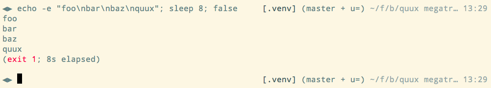
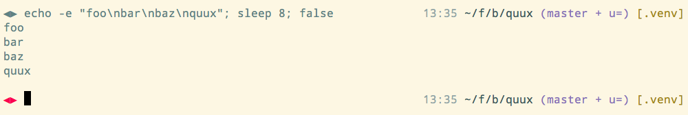
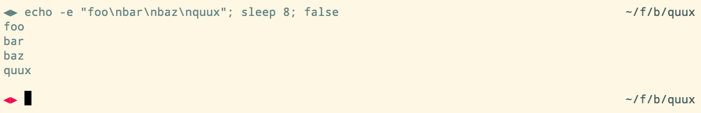

# Dexter, a zsh theme.

A theme with an emphasis on the right side of the terminal. It works best with
terminals wider than the standard 80 columns.

## License

Copyright (c) 2016 by Shiv Venkatasubrahmanyam <shiv@alum.mit.edu>.
License: Apache License 2.0

## Examples

Here's how this theme looks with the
[solarized](http://ethanschoonover.com/solarized) light color palette.

With default settings:

With some custom settings:

With simple settings:

## Features

  * A blank line is printed before each prompt to visually separate successive
    commands.

  * The left prompt is simple and of fixed length, aligning and visually marking
    the commands, making them easy to distinguish from command output on the
    screen. The default is a diamond `◀▶`.

  * The right prompt can show the following information, if configured and the
    corresponding plugins are available:
      + python virtualenv, using the oh-my-zsh `virtualenv` plugin;
      + git status, using the oh-my-zsh `gitfast` plugin;
      + abbreviated working directory, using the oh-my-zsh `shrink-path` plugin;
      + abbreviated hostname; and
      + time of day in 24-hour format (hh:mm).
    The selection and color of elements in the right prompt can be customized.

  * Information about the previous command, if relevant, is shown within
    parentheses after the last line of command output.
      + If the previous command exited with a non-zero status or exited due to a
        signal, the exit status or signal is shown in red.
      + If the previous command took longer than a configurable time limit to
        run, the wall clock time elapsed in shown in suitable units.

    Alternatively, the color of the left prompt can indicate non-zero exit.

## Installation and Use

To use this plugin, in your `~/.zshrc`:

 1. Source the plugins you need for the right prompt,
 2. Set the `DEXTER_*` configuration variables described below, and
 3. Source this file.

A plugin manager is highly recommended to simplify installation and loading.
For instance, using [zplug](https://github.com/zplug/zplug) and the following,
you could customize your shell to look like the "custom" example above.

    ...  # Load zplug.
    zplug "plugins/shrink-path", from:oh-my-zsh
    zplug "plugins/gitfast", from:oh-my-zsh, defer:1
    zplug "plugins/virtualenv", from:oh-my-zsh
    zplug "shvenkat/zsh-theme-dexter", use:"*.zsh", defer:3
    DEXTER_RIGHT_PROMPT_ELEMS=(time workdir git venv)
    DEXTER_WORKDIR_COLOR=$fg_bold[green]
    DEXTER_GIT_COLOR=$fg_bold[magenta]
    DEXTER_VENV_COLOR=$fg[yellow]
    DEXTER_SHOW_EXIT_MESSAGE=0
    DEXTER_SHOW_ELAPSED_TIME=0
    ...
    zplug load

## Customization

To customize this theme, set the following variables before sourcing this
file. Default values are shown below.

    DEXTER_LEFT_PROMPT_STRING=◀▶           # No trailing space.

The prompt string. __A space will be printed to the right of this string__.

    DEXTER_RIGHT_PROMPT_ELEMS=(venv git workdir host time)

The sequence of elements in the right prompt. Use `()` to disable the right
prompt.

    DEXTER_VENV_COLOR=$fg_bold[green]      # Darker than foreground.
    DEXTER_GIT_COLOR=$fg[default]`         # Foreground text color.
    DEXTER_WORKDIR_COLOR=$fg_bold[cyan]`   # Lighter than foreground.
    DEXTER_HOST_COLOR=$fg_bold[cyan]`      # Lighter than foreground.
    DEXTER_TIME_COLOR=$fg_bold[cyan]`      # Lighter than foreground.

The color of right prompt elements. The default colors are intended for use with
the solarized light palette. Any terminal/ANSI color specification supported by
zsh or your terminal can be used.

    DEXTER_SHOW_EXIT_MESSAGE=1

If set to `1`, the non-zero exit status of the last command is shown within
parentheses below command output. If zero, non-zero exit is indicated by the
color of the left prompt.

    DEXTER_EXIT_STATUS_COLOR=$fg[red]

The color used to indicate non-zero exit of the previous command. It is used
either in the exit status message if `DEXTER_SHOW_EXIT_MESSAGE` is `1`, or in
the left prompt.

    DEXTER_SHOW_ELAPSED_TIME=1
    DEXTER_TIME_LIMIT_SECS=5

If set to `1`, the wall-clock time consumed by the last command, if longer than
`DEXTER_TIME_LIMIT_SECS`, is shown within parentheses below command output.

    DEXTER_UNTIMED_COMMANDS=("more" "less" "emacs" "emacsclient" "nvim" "vim"
                             "man" "git" "time")

The commands for which elapsed time is not shown. These are typically
interactive programs. Elements of this array are strings -- possibly with more
than one word -- that match the beginning of excluded commands. Matching is
performed _after alias expansion_.
