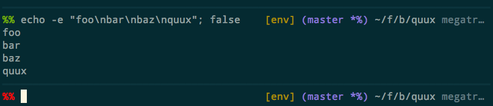
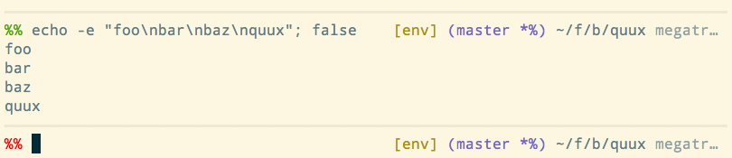

# Dexter, a zsh theme.

A theme with an emphasis on the right side (hence the name) of the terminal.

## Examples

Here's how this theme looks with the [solarized]
(http://ethanschoonover.com/solarized) color palette, in dark and
light modes.

## Features

* A horizontal line before each prompt.

* The left prompt indicates:
  + exit status of the previous command (green for 0, red otherwise), and
  + privilege of the shell (## if privileged, %% otherwise).

* The right prompt shows the following information from left to right, if
  the corresponding plugins are available:
  + python virtualenv, using the virtualenv plugin (robbyrussell/oh-my-zsh),
  + git status, using the gitfast plugin (robbyrussell/oh-my-zsh),
  + fish-style abbreviated working directory, using the shrink-path plugin
    (robbyrussell/oh-my-zsh), and
  + abbreviated hostname.

## Customization

The color of certain elements can be customized using the following
variables. The default colors shown below are intended for use with
the solarized dark palette. To override these, specify any valid
terminal/ANSI color escape sequences.

    DEXTER_SEPARATOR_COLOR       black        $fg[black]
    DEXTER_EXIT_SUCCESS_COLOR    green        $fg[green]
    DEXTER_EXIT_FAILURE_COLOR    red          $fg[red]
    DEXTER_VENV_COLOR            yellow       $fg[yellow]
    DEXTER_GIT_COLOR             violet       $fg_bold[magenta]
    DEXTER_WORKDIR_COLOR         normal       $fg[default]
    DEXTER_HOSTNAME_COLOR        dark gray    $fg_bold[green]

The line drawing character(s) can be changed using the variable
DEXTER_SEPARATOR_CHARS. The default value is the Unicode character
'BOX DRAWINGS HEAVY HORIZONTAL' (U+2501).

## License

Copyright (c) 2016 by Shiv Venkatasubrahmanyam <shiv@alum.mit.edu>.

License: MIT.
